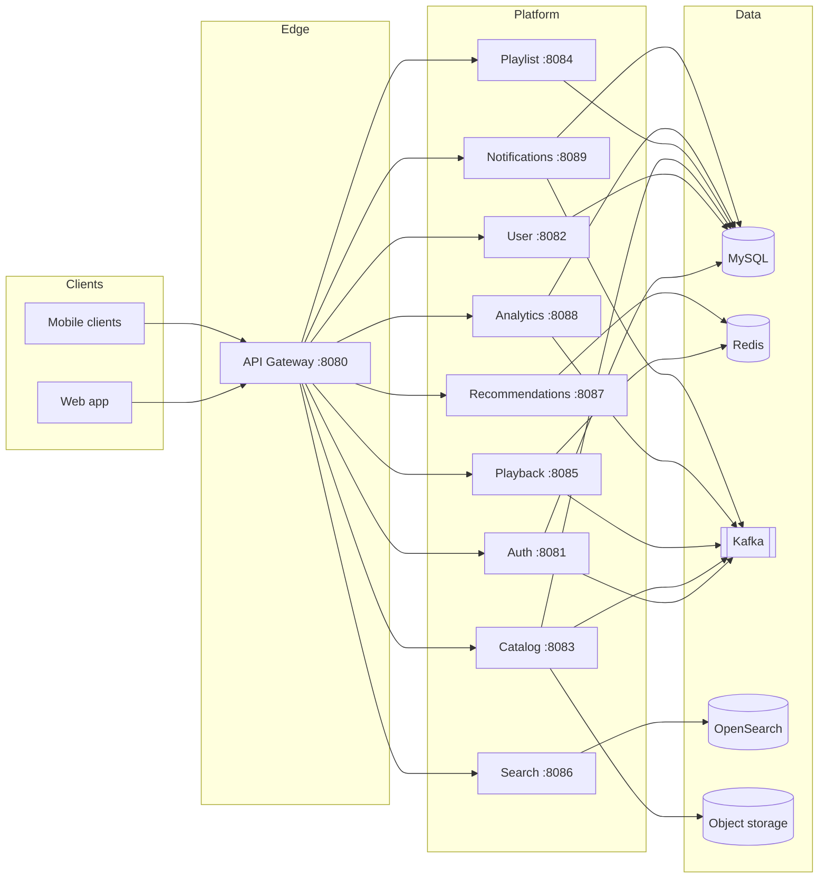
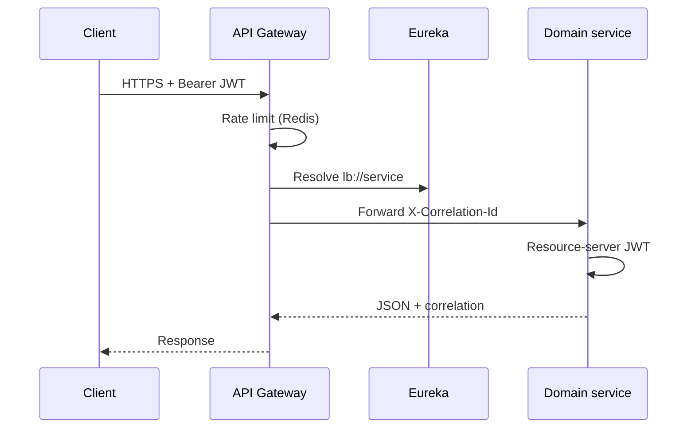

# Harmonia Architecture

Harmonia is a music streaming platform built as independently deployable Spring Boot services behind an API gateway. Clients never talk to domain services directly.

## System context

## Control plane

| Component | Port | Role |
| --- | --- | --- |
| Config Server | 8888 | Native Git-less config from `config-repo/` |
| Eureka | 8761 | Service discovery used by the gateway (`lb://`) |
| API Gateway | 8080 | Routing, JWT resource server, Redis rate limit |
| Prometheus / Grafana | 9090 / 3000 | Metrics scrape of `/actuator/prometheus` |

## Domain services

| Service | Port | Persistence | Notes |
| --- | --- | --- | --- |
| auth-service | 8081 | `harmonia_auth` | Registration, login, JWT, refresh rotation |
| user-service | 8082 | `harmonia_user` | Profiles, library, follows |
| catalog-service | 8083 | `harmonia_catalog` + MinIO | Artists, albums, tracks, media |
| playlist-service | 8084 | `harmonia_playlist` | Playlists and collaborators |
| playback-service | 8085 | Redis | Queue, session, play events |
| search-service | 8086 | OpenSearch | Query + index consumers |
| recommendation-service | 8087 | Redis | Personalized shelves |
| analytics-service | 8088 | `harmonia_analytics` | Admin reporting from Kafka |
| notification-service | 8089 | `harmonia_notification` | In-app + email channels |

## Request path

## Design principles

- **API-first**: versioned `/api/v1` routes, OpenAPI on each MVC service.
- **Async facts**: Kafka `DomainEvent` envelopes, never PII in logs.
- **Defense in depth**: gateway auth plus method security on services.
- **Fail independently**: circuit breakers and timeouts at the gateway.
- **Observable by default**: health probes, Prometheus, correlation IDs.
