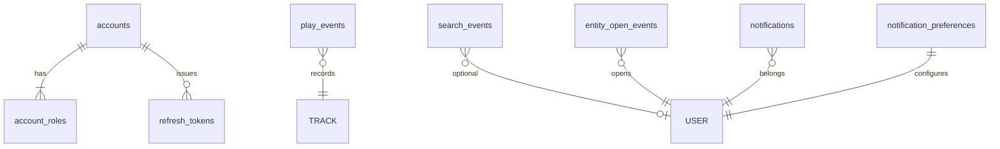

# Harmonia Data Model

Each bounded context owns its MySQL schema. Services do not share tables. Cross-context references are UUIDs carried in APIs and Kafka payloads.

## Logical map

`TRACK` and `USER` above are logical owners in other schemas, not foreign keys across databases.

## Auth (`harmonia_auth`)

| Table | Purpose |
| --- | --- |
| `accounts` | Email, password hash, lockout, verification flags |
| `account_roles` | `LISTENER`, `ARTIST`, `ADMIN`, `MODERATOR` |
| `refresh_tokens` | SHA-256 hashed refresh tokens, rotatable |
| `email_verification_tokens` | Hashed, single-use |
| `password_reset_tokens` | Hashed, single-use |

## Analytics (`harmonia_analytics`)

### `play_events`

| Column | Notes |
| --- | --- |
| `id` | UUID |
| `user_id` | Required |
| `track_id` | Required |
| `artist_id` | Optional; stored when present on the Kafka payload |
| `event_type` | `PLAY_STARTED`, `COMPLETED`, `SKIPPED` |
| `position_ms` | Playback position at the event |
| `occurred_at` | Event time (UTC) |

Indexes: `(track_id, occurred_at)`, `(user_id, occurred_at)`, `(artist_id, occurred_at)`.

### `search_events`

`user_id` is nullable so anonymous search still contributes to query analytics.

### `entity_open_events`

`entity_type` is `PLAYLIST`, `ARTIST`, or `ALBUM`.

## Notifications (`harmonia_notification`)

### `notifications`

In-app inbox. `read_flag` plus `(user_id, read_flag, created_at)` supports unread-first listing. `metadata` is JSON without secrets.

### `notification_preferences`

Primary key `user_id`. Defaults: email on, in-app on, push off.

## Other schemas

| Database | Owner | Intent |
| --- | --- | --- |
| `harmonia_user` | user-service | Profiles, follows, library |
| `harmonia_catalog` | catalog-service | Artists, albums, tracks, assets |
| `harmonia_playlist` | playlist-service | Playlists, items, collaborators |

Playback and recommendations use Redis, not MySQL. Search uses OpenSearch.

## Conventions

- UUID primary keys stored as `CHAR(36)`.
- Timestamps are UTC `DATETIME(3)`.
- Flyway owns DDL (`V1__...`). Hibernate `ddl-auto: validate`.
- No cross-schema foreign keys.
