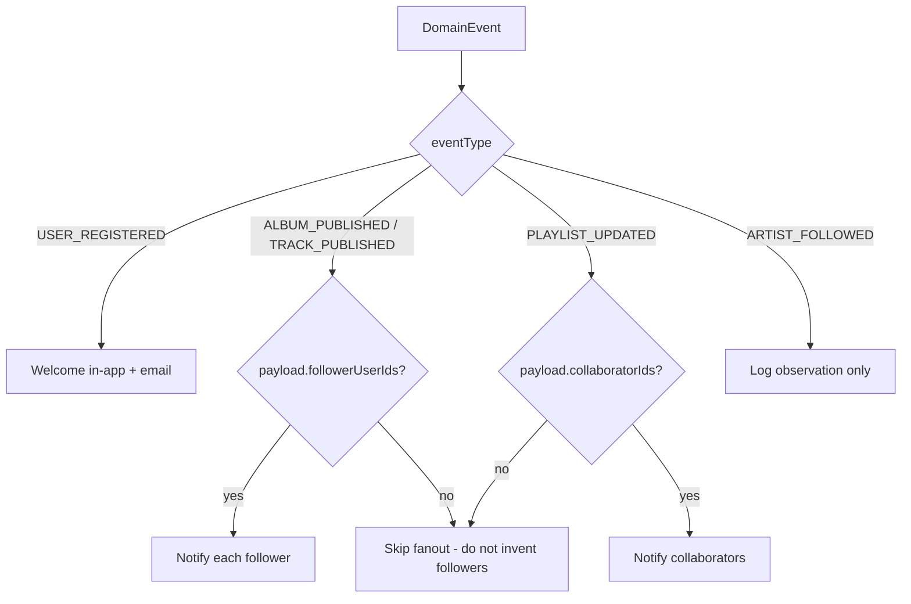

# Harmonia Domain Events

Services publish `DomainEvent` records to Kafka. The envelope is:

| Field | Meaning |
| --- | --- |
| `eventId` | UUID |
| `eventType` | `EventType` name |
| `version` | Schema version (currently 1) |
| `occurredAt` | UTC instant |
| `aggregateType` / `aggregateId` | Source entity |
| `producer` | Service name |
| `traceId` | Correlation |
| `userId` | Actor when known |
| `payload` | JSON object, no secrets in logs |

## Topics

| Constant | Topic | Typical producers |
| --- | --- | --- |
| `Topics.USER` | `harmonia.user.events` | auth, user |
| `Topics.CATALOG` | `harmonia.catalog.events` | catalog |
| `Topics.PLAYLIST` | `harmonia.playlist.events` | playlist |
| `Topics.PLAYBACK` | `harmonia.playback.events` | playback |
| `Topics.SEARCH` | `harmonia.search.events` | search |
| `Topics.SOCIAL` | `harmonia.social.events` | user / social |

## Event catalog

| Event | Topic | Consumers |
| --- | --- | --- |
| `USER_REGISTERED` | USER | notification (welcome) |
| `USER_VERIFIED` | USER | user-service |
| `PASSWORD_RESET_REQUESTED` | USER | notification (no address log) |
| `TRACK_PLAYED` / `PLAYBACK_STARTED` | PLAYBACK | analytics → `PLAY_STARTED` |
| `PLAYBACK_COMPLETED` | PLAYBACK | analytics → `COMPLETED` |
| `TRACK_SKIPPED` | PLAYBACK | analytics → `SKIPPED` |
| `SEARCH_PERFORMED` | SEARCH or USER | analytics |
| `PLAYLIST_OPENED` / `ARTIST_OPENED` / `ALBUM_OPENED` | playlist/catalog | analytics entity opens |
| `TRACK_PUBLISHED` / `ALBUM_PUBLISHED` | CATALOG | search index, notification fanout |
| `ARTIST_FOLLOWED` | SOCIAL | notification observes only |
| `PLAYLIST_UPDATED` | PLAYLIST | notification if `collaboratorIds` present |

## Notification fanout rules

Harmonia does not keep a follower graph inside notification-service. If the publisher omits `followerUserIds`, v1 skips fanout.

## Payload conventions

Playback: `trackId`, optional `artistId`, optional `positionMs`.  
Search: `query`.  
Publish: optional `followerUserIds: UUID[]`.  
Collaborative playlists: `collaborative`, `collaboratorIds`.
