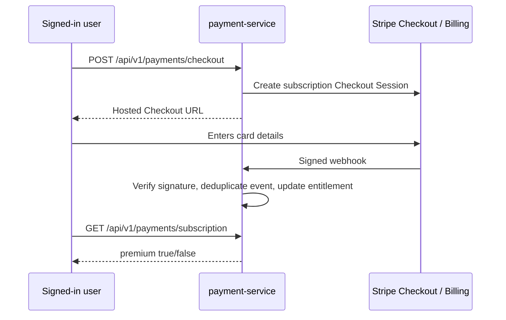

# Stripe subscription flow

The payment service owns billing state; auth-service is deliberately not involved beyond issuing the user's JWT. Card data never reaches Harmonia.

## Setup in Stripe test mode

1. Create a recurring monthly Product/Price in the Stripe Dashboard and copy its `price_...` ID.
2. Set `STRIPE_SECRET_KEY`, `STRIPE_PRICE_ID_PREMIUM_MONTHLY`, and `APP_PUBLIC_URL` for payment-service. The price and secret key stay server-side.
3. Forward Stripe events to `POST /api/v1/payments/webhooks/stripe` through a public HTTPS URL (or `stripe listen --forward-to localhost:8080/api/v1/payments/webhooks/stripe` locally). Copy the resulting `whsec_...` value into `STRIPE_WEBHOOK_SECRET`.
4. Subscribe to `checkout.session.completed`, `customer.subscription.created`, `customer.subscription.updated`, and `customer.subscription.deleted`.

Use `POST /api/v1/payments/checkout` with a bearer token; redirect the browser to `checkoutUrl`. The webhook, rather than the success redirect, is authoritative. `POST /api/v1/payments/portal` returns Stripe's hosted customer portal for cancellation and payment-method changes. `GET /api/v1/payments/subscription` is the entitlement check for other services.

For Stripe test mode, use card `4242 4242 4242 4242` with any future date, CVC, and postal code. Do not use this design with application-side card fields or client-visible Stripe secret/webhook keys.
