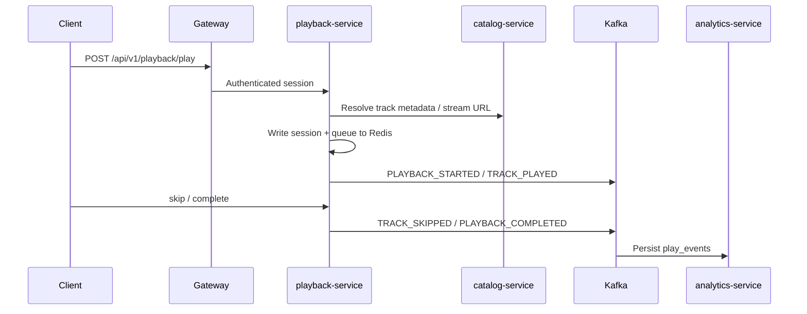

# Harmonia Playback

Playback-service owns the listening session: queue, position, device, and play telemetry. Audio bytes themselves are streamed from object storage via catalog-service, not from the playback process.

## Session flow

## Events

| Client action | Kafka type | Analytics `event_type` |
| --- | --- | --- |
| Start or resume a track | `PLAYBACK_STARTED` or `TRACK_PLAYED` | `PLAY_STARTED` |
| Reach the end | `PLAYBACK_COMPLETED` | `COMPLETED` |
| Skip | `TRACK_SKIPPED` | `SKIPPED` |

Include `trackId` (required) and `artistId` when known so admin overview can populate `topArtists`.

## Session store

Redis holds:

- Current track and queue
- Position in milliseconds
- Repeat / shuffle flags
- Last heartbeat

Sessions are per user. A new play on another device replaces the active session (single active listener in v1).

## Streaming

1. Client obtains a short-lived object URL from catalog `/api/v1/storage/**` or a proxied byte range.
2. Playback-service authorizes that the user may play the track (published, not removed).
3. Progress pings may emit additional `TRACK_PLAYED` facts; analytics counts `PLAY_STARTED` as a stream.

## Failure modes

- Catalog unavailable: gateway circuit breaker, playback returns `UPSTREAM_UNAVAILABLE`.
- Redis unavailable: no session mutations; health readiness fails.
- Kafka unavailable: play still succeeds for the listener; telemetry is retried by the producer path.
