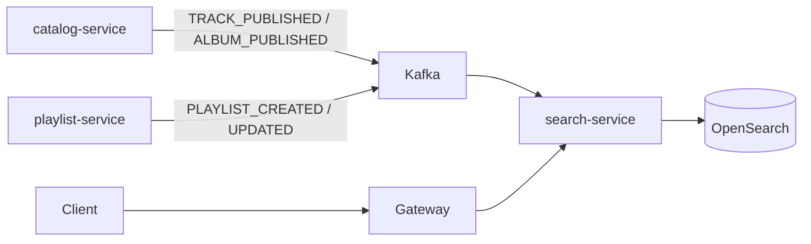

# Harmonia Search

Search-service is the query and indexing facade over OpenSearch. It does not own catalog data; it projects published catalog and playlist documents.

## Indexing

Consumers listen on `harmonia.catalog.events` and `harmonia.playlist.events`. Unpublished or deleted aggregates are removed from the index.

## Query API

`GET /api/v1/search?q=&type=&page=&size=`

| Param | Meaning |
| --- | --- |
| `q` | Free text (track, artist, album, playlist) |
| `type` | Optional filter: `track`, `artist`, `album`, `playlist` |
| `page` / `size` | Pagination |

Anonymous GET is allowed. When a JWT is present, `userId` is attached to `SEARCH_PERFORMED`.

## Search analytics

On each query, search-service publishes `SEARCH_PERFORMED` to `harmonia.search.events` (also accepted on the user topic). analytics-service stores `search_events` with nullable `user_id`.

## OpenSearch

- Local: `opensearchproject/opensearch:2.18.0`, `DISABLE_SECURITY_PLUGIN=true`, `discovery.type=single-node`.
- URL: `OPENSEARCH_URL` (default `http://localhost:9200`).
- Production: managed OpenSearch/Elasticsearch-compatible cluster with TLS; do not run the demo security plugin.

## Resilience

If OpenSearch is down, search-service returns `SEARCH_UNAVAILABLE` (mapped from `ErrorCode.SEARCH_UNAVAILABLE`). Indexing retries follow the Kafka consumer backoff.
