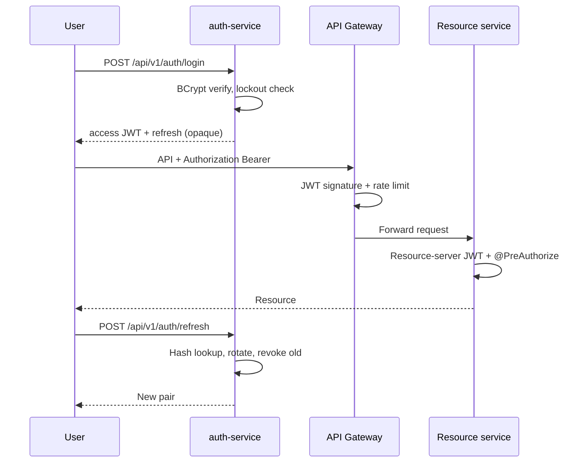

# Harmonia Security

## Authentication

- Access tokens: HS256 JWT, issuer `harmonia-auth`, 15 minutes, claims `sub`, `email`, `roles`.
- Refresh tokens: 256-bit random, SHA-256 at rest, 7-day TTL, rotated on use.
- Password hashing: BCrypt cost 12.
- Lockout: 5 failed attempts, 15-minute lock.
- Self-registration is limited to `LISTENER` and `ARTIST`.

The HMAC secret comes from `JWT_SECRET` / `harmonia.security.jwt.secret`. Never log it.

## Authorization

Roles: `LISTENER`, `ARTIST`, `ADMIN`, `MODERATOR`. JWT `roles` claim is comma-separated; resource servers map them to `ROLE_*` authorities.

Examples:

- Analytics read APIs: `hasRole('ADMIN')`.
- Notifications: authenticated owner only (`CurrentUser`).
- Catalog writes: artist/admin (enforced in catalog-service).

## Transport and headers

- Gateway Redis rate limiter (50 req/s replenish, burst 100) keyed by client IP.
- Correlation: `X-Correlation-Id` / `X-Request-Id` generated or propagated.
- Security headers: `X-Content-Type-Options`, frame deny, no referrer.
- CSRF disabled (stateless bearer API).

## Secrets and PII

- No production passwords in source. Use `.env` / Kubernetes Secrets.
- Email verification and reset tokens are hashed; raw tokens travel only on Kafka for the intended consumer and must not be logged.
- Notification email channel logs `email dispatched to user {id} type {type}` without addresses or tokens.
- MinIO and mail credentials are environment-injected.

## Bootstrap admin

On empty auth database, auth-service can create an admin from `ADMIN_EMAIL` and `ADMIN_BOOTSTRAP_PASSWORD`. Change both before any shared environment is used.
